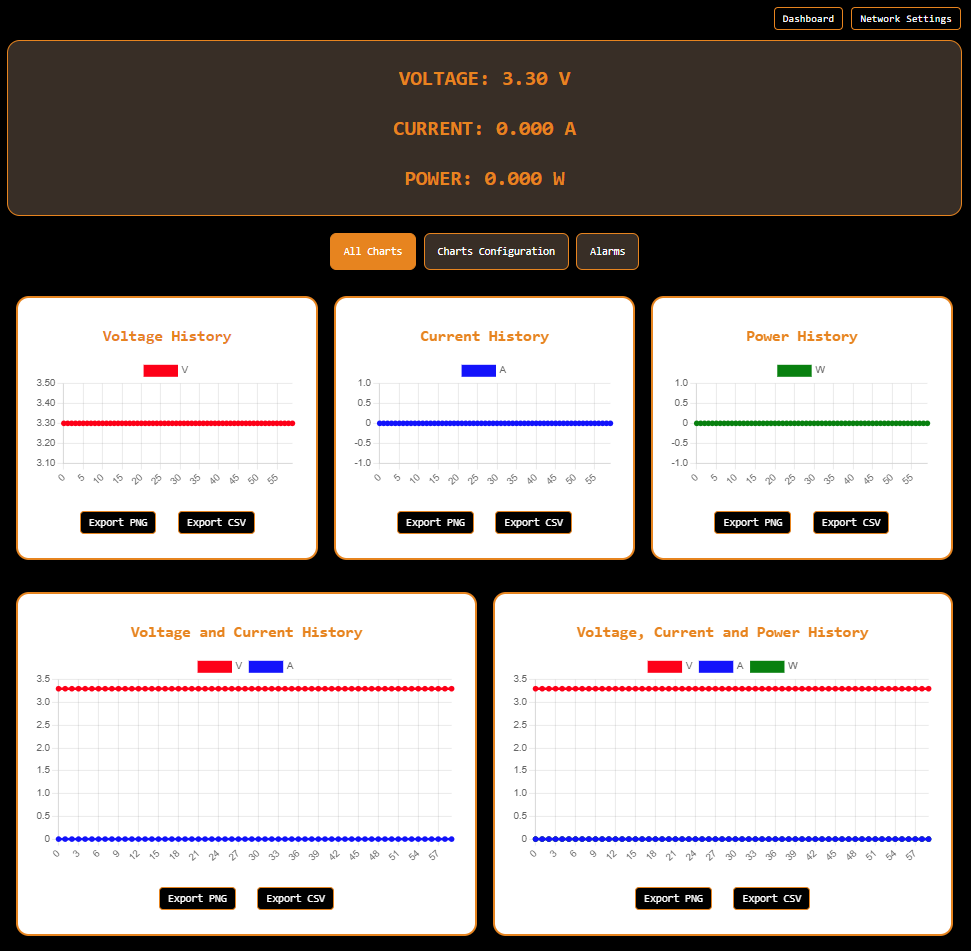
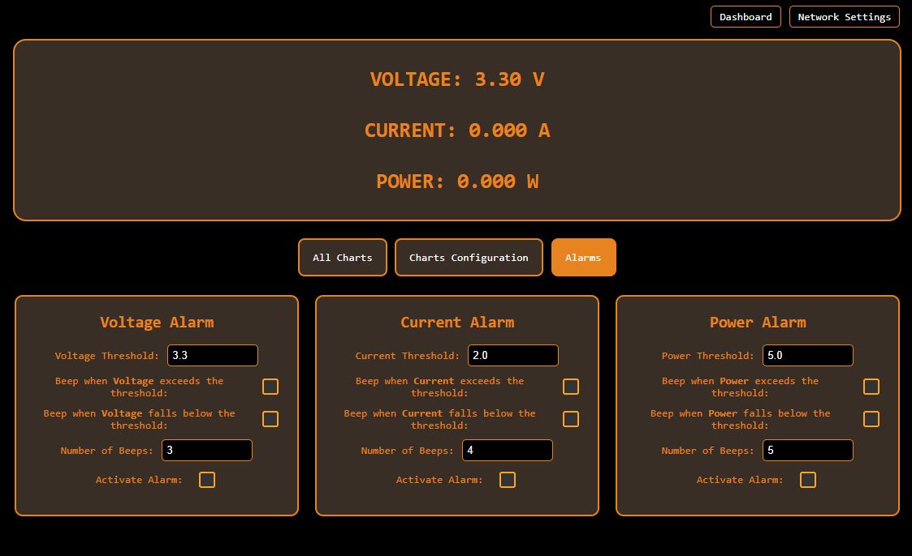
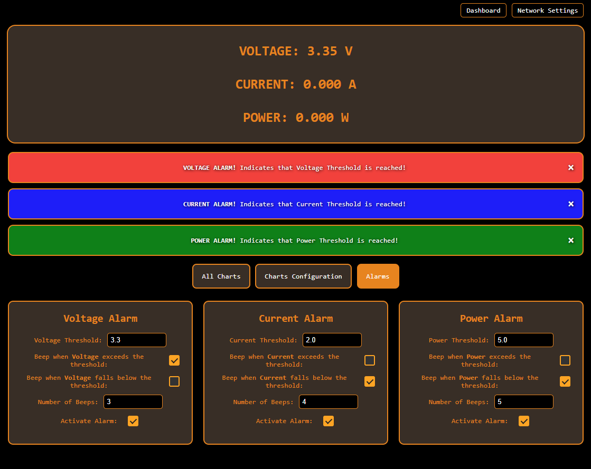
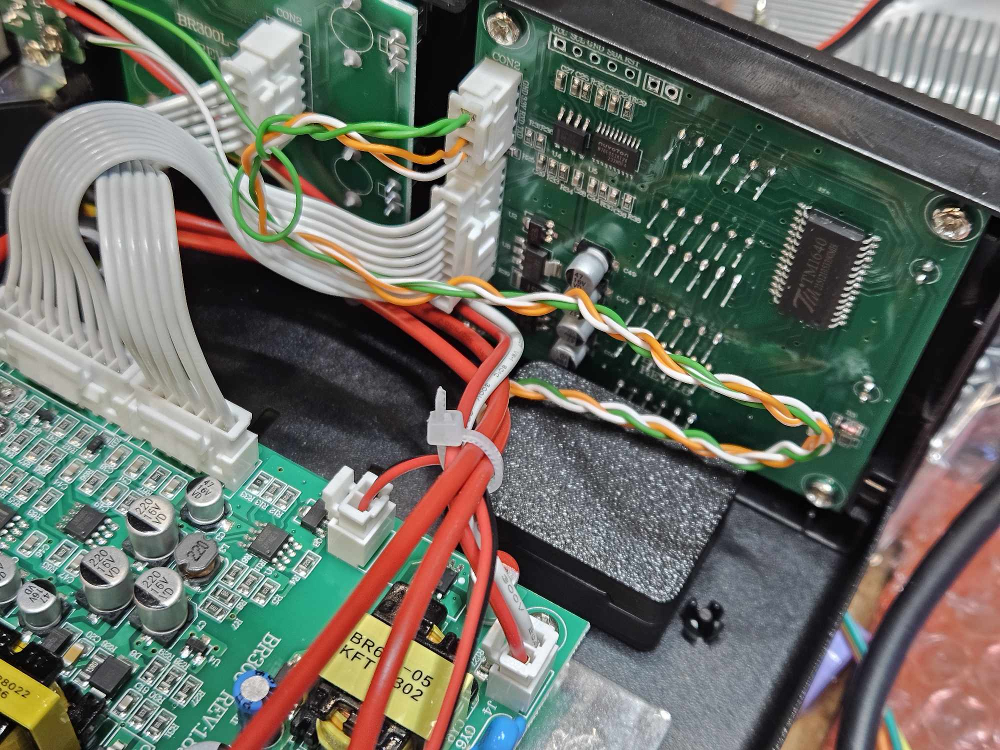
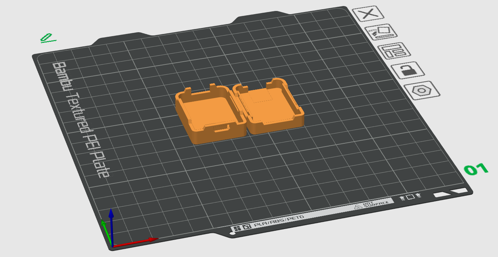

# PowerLinkESP

PowerLinkESP is an advanced firmware designed to enhance Nice-Power bench power supplies with ESP8266 connectivity, providing advanced monitoring and control capabilities.


## Overview

PowerLinkESP revolutionizes the interaction with Nice-Power bench power supplies by offering seamless integration via UART protocol. Designed with versatility and user-friendliness in mind, this firmware empowers users to monitor, control, and optimize their bench power supply experience through a sophisticated yet intuitive user interface.

## Features

### User Interface

- **Real-time Monitoring:** Dynamic gauges provide live updates on voltage, current, and power output.
- **Interactive Charts:** Dive deeper into your data with interactive charts for voltage, current, and power.
- **Export Functionality:** Export chart data history in PNG or CSV format for further analysis.
- **Persistent Information Bar:** Access live information about voltage, current, and power on a persistent bottom bar.
- **Customizable History Range:** Set the history range in minutes for chart data.
- **Customizable Update Frequency:** Set the update frequency in milliseconds for chart data.
- **Customizable Threshold Alarms:** Set custom threshold Alarm notifications with audible alerts when Voltage, Current, or Power reach specified values.

### Network Configuration

- **Dynamic & Static IP Support:** Choose between dynamic and static IP assignment.
- **WIFI AP or STA Mode:** Configure the ESP8266 in access point (AP) or station (STA) mode.
- **Automatic AP Mode:** Automatically switch to AP mode if the configured station (STA) network is unavailable.


### Communication & Connectivity

- **UART Communication:** Ensure reliable data transmission with Nice-Power bench power supplies.
- **Async Web Server:** Enjoy responsive and efficient communication with the user interface.
- **OTA (Over-The-Air) Updates:** Update firmware directly from the Arduino IDE.
- **EEPROM Configuration Store:** Store configuration settings in EEPROM memory for persistent operation.

## UI Interface

#### Big Screen - All Charts


#### Big Screen - Charts Configuration


#### Big Screen - Threshold Alarms




#### Big Screen - Settings Page


#### Mobile Screen - Dashboard


When we scrolling the top display with values is hidden, but we have handy pinned display with the values at the bottom.


## Hardware Setup

**Wiring Schematic:**


- Refer to the provided wiring schematic for proper connection between the Wemos D1 mini microcontroller and the Nice-Power bench power supply via UART.


- You need to connect Nice-Power supply UART Port to the WEMOS D1 Mini.
- RX from Nice-Power needs to be connected to the D5 pin on the WEMOS D1 Mini
- TX from Nice-Power needs to be connected to the D6 pin on the WEMOS D1 Mini
- We need to connect GND Pin to the WEMOS D1 Mini GND pin and also to the Nice-Power USB GND pin.


- We need to power the WEMOS D1 Mini from the Nice-Power supply USB port.




**3D Printed Case for Wemos D1 mini:**

- I used this 3D printed case designed specifically for the Wemos D1 mini microcontroller - https://makerworld.com/en/models/20157
- You can find also the STL files in "3DModelCaseFiles" directory. 



## Installation

1. **Clone the Repository (Latest Version):**
   [git clone https://github.com/yourusername/powerlink-esp.git](https://github.com/dobrishinov/PowerLinkESP.git)
   
   **OR**

   **Get the Latest Stable Release:**
   - If you prefer a stable release, follow these steps:
      - Visit the repository’s releases page.
      - Look for the desired version (usually tagged as "Stable").
      - Download the release package associated with that version.
      - Extract the contents to your preferred location.

2. **Setup Arduino IDE:**
   - Download and Install Arduino IDE:
      - The project is build on Arduino version ***1.8.19***, you can try to build it with the latest version, but in case of a problem try with ***1.8.19***
      - Install the IDE by following the instructions for your operating system.

   - Install Required Libraries:

      - Open Arduino IDE.
      - Go to **Sketch > Include Library > Manage Libraries...**.
      - In the Library Manager, search for and install the following libraries:
         - **ESPAsyncTCP** (version ***1.2.2*** from Me-No-Dev)
         - **ESPAsyncWebServer** (version ***1.2.3*** from Me-No-Dev)
         - **TaskScheduler** (version ***3.7.0*** from Anatoli Arkhipenko)
         - ***The Libraries are also included in this repository***
   
   - Add ESP8266 Board to Arduino IDE:
      - Go to **File > Preferences**.
      - In the "Additional Board Manager URLs" field, add the following URL: 
      ```http://arduino.esp8266.com/stable/package_esp8266com_index.json```
      - Click **OK**
      - Go to **Tools > Board > Boards Manager**.
      - Search for **esp8266** and install **esp8266 by ESP8266 Community**.

3. **Upload Firmware:**
   - Open the Project:
      - Open the Arduino IDE.
      - Go to **File > Open** and navigate to the cloned repository folder. Open the .ino file within the repository.

   - Select the Board:
      - Go to **Tools > Board > ESP8266 Boards** and select **LOLIN(WeMos) D1 mini (clone)**.

   - Configure Board Settings:

      - Ensure the following settings under the Tools menu:
         - Board: ***LOLIN(WeMos) D1 mini (clone)***
         - Flash Size: ***4M (FS:2MB OTA:~1019KB)***
         - Upload Speed: ***921600***
   - Connect the Device:
      - Connect your LOLIN(WeMos) D1 mini (clone) mini to your computer via USB.

   - Upload the Firmware:
      - Click the Upload button (right arrow icon) in the Arduino IDE.
      - Wait for the IDE to compile and upload the firmware to your LOLIN(WeMos) D1 mini (clone) device.

   - Upload the Web Page Data files

      - Install **Arduino ESP8266 LittleFS Filesystem Uploader**
      - Open your Arduino directory and put the ***esp8266fs.jar*** which you can find 
      in the repository Arduino directory. The path should be something like this one:
      ```~Documents/Arduino/tools/ESP8266FS/tool/esp8266fs.jar```
      - If you have problems with this step please check the links below:
         - https://randomnerdtutorials.com/install-esp8266-nodemcu-littlefs-arduino/
         - https://github.com/earlephilhower/arduino-esp8266littlefs-plugin
      - Then make sure you have selected a board, port, and closed Serial Monitor.
      - Select **Tools > ESP8266 LittleFS Data Upload** menu item. This should start uploading the files into ESP8266 flash file system. When done, IDE status bar will display LittleFS Image Uploaded message. Might take a few minutes for large file system sizes.
      

4. **Additional Notes**

   - Make sure you have the correct COM port selected under **Tools > Port**.
   - If you encounter any issues during the upload process, ensure your device drivers are properly installed and try using a different USB cable.
   - The default WIFI password for the Access Point is ***12345678***. If you want to change it please edit the password for the AP in the code. The variable is ***fallbackPassword***.

## Usage

**Accessing the User Interface:**

There is two working modes:
   - Access Point Mode
      - On First boot the device is created Access Point with name: ***LabPowerSupply_[IdOfTheESP]***
      - The default WIFI password for the Access Point is ***12345678***. (If you want to change it please edit the password for the AP in the code. The variable is ***fallbackPassword***).
      - Open in the URL ***192.168.4.1*** and you can see the UI Interface.
      - Go to the Settings page and add your WIFI credentials if you want to use the device in your local network.

   - Station Mode
      - Connect the Wemos D1 mini to your local network and obtain its IP address.
      - Open a web browser and enter the IP address of the Wemos D1 mini to access the user interface.
      - Explore the intuitive user interface to monitor real-time data from the bench power supply.
      - Utilize interactive charts and export functionality to analyze historical data.
      - Customize network settings and configuration options as needed.
      - If the WIFI network is not reachable, the device will run automatically in Access Point Mode.

## To-Do / Wishlist

Below is a list of upcoming features and enhancements:

:heavy_check_mark: [Done] Added option to set the update frequency for the charts.

:heavy_check_mark: [Done] Added favicon with nice power icon.

:heavy_check_mark: [Done] Added Alarm threshold notifications with audible alerts when Voltage, Current, or Power reach specified values..

:hourglass_flowing_sand: Update README regularly.

:star: :rainbow: :star: Feel free to suggest new features or improvements by opening an issue or submitting a pull request. Your contributions are always welcome!

## Contributing

Contributions from the community is welcome! I'll be happy for further enhance the functionality and usability of PowerLinkESP. Whether you're a seasoned developer or a passionate enthusiast, your contributions are invaluable to shared success. 
In the Documents directory, you’ll find a useful document explaining how the serial port protocol works. This protocol may also be applicable to power supplies from other brands.
Feel free to explore the repository, open issues, submit pull requests, or engage in discussions to contribute to the ongoing development efforts.

## License

This project is licensed under the GPL-3.0 license - see the [LICENSE](LICENSE) file for details.

## Contact

For feedback, or collaboration opportunities, please contact [dobrishinov@gmail.com](mailto:dobrishinov@gmail.com)
