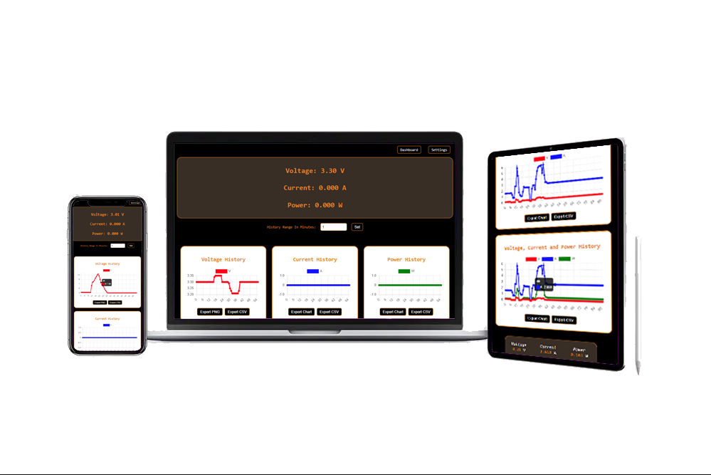
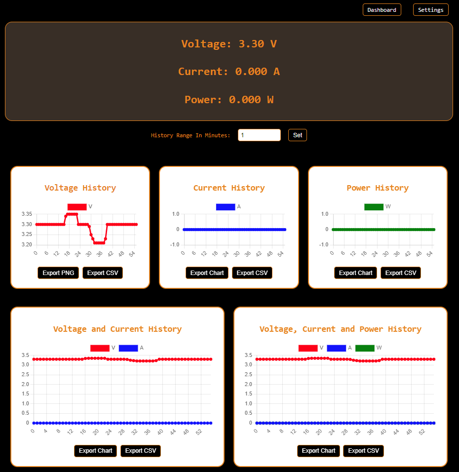
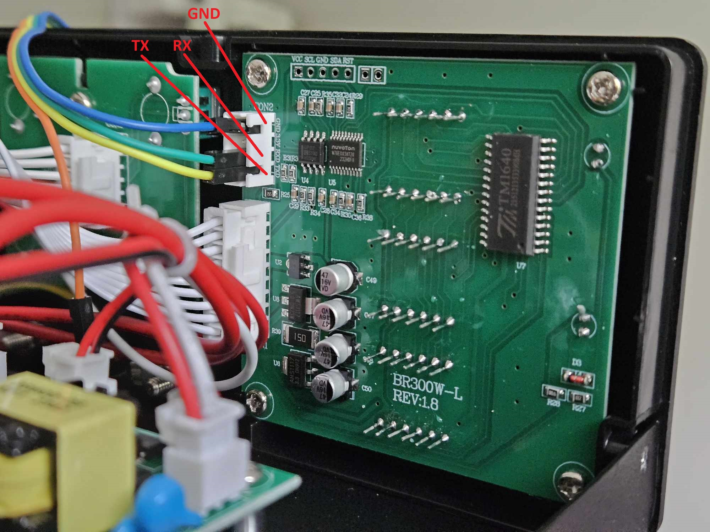
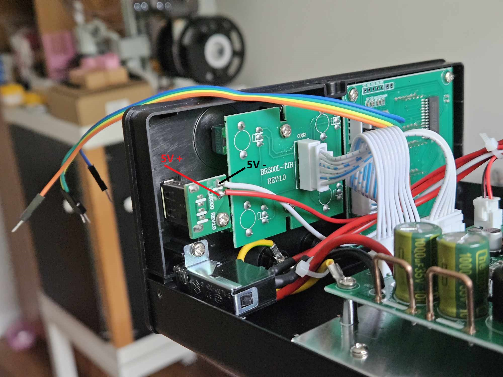

# PowerLinkESP

PowerLinkESP is an advanced firmware designed to enhance Nice-Power bench power supplies with ESP8266 connectivity, providing advanced monitoring and control capabilities.

## Overview

PowerLinkESP revolutionizes the interaction with Nice-Power bench power supplies by offering seamless integration via UART protocol. Designed with versatility and user-friendliness in mind, this firmware empowers users to monitor, control, and optimize their bench power supply experience through a sophisticated yet intuitive user interface.

## Features

### User Interface

- **Real-time Monitoring:** Dynamic gauges provide live updates on voltage, current, and power output.
- **Interactive Charts:** Dive deeper into your data with interactive charts for voltage, current, and power.
- **Export Functionality:** Export chart data history in PNG or CSV format for further analysis.
- **Persistent Information Bar:** Access live information about voltage, current, and power on a persistent bottom bar.
- **Customizable History Range:** Set the history range in minutes for chart data.

### Network Configuration

- **Dynamic & Static IP Support:** Choose between dynamic and static IP assignment.
- **WIFI AP or STA Mode:** Configure the ESP8266 in access point (AP) or station (STA) mode.
- **Automatic AP Mode:** Automatically switch to AP mode if the configured station (STA) network is unavailable.

### Communication & Connectivity

- **UART Communication:** Ensure reliable data transmission with Nice-Power bench power supplies.
- **Async Web Server:** Enjoy responsive and efficient communication with the user interface.
- **OTA (Over-The-Air) Updates:** Update firmware directly from the Arduino IDE.
- **EEPROM Configuration Store:** Store configuration settings in EEPROM memory for persistent operation.

## UI Interface

#### Big Screen - Dashboard

#### Big Screen - Settings Page

#### Mobile Screen - Dashboard

When we scrolling the top display with values is hidden, but we have handy pinned display with the values at the bottom.

## Hardware Setup

**Wiring Schematic:**

- Refer to the provided wiring schematic for proper connection between the Wemos D1 mini microcontroller and the Nice-Power bench power supply via UART.

- You need to connect Nice-Power supply UART Port to the WEMOS D1 Mini.
- RX from Nice-Power needs to be connected to the D5 pin on the WEMOS D1 Mini
- TX from Nice-Power needs to be connected to the D6 pin on the WEMOS D1 Mini
- We need to connect GND Pin to the WEMOS D1 Mini GND pin and also to the Nice-Power USB GND pin.

- We need to power the WEMOS D1 Mini from the Nice-Power supply USB port.

**3D Printed Case for Wemos D1 mini:**

- I used this 3D printed case designed specifically for the Wemos D1 mini microcontroller - https://makerworld.com/en/models/20157

- You can find also the STL files in "3DModelCaseFiles" directory. 

## TODO - Installation

1. **Clone the Repository:**
   [git clone https://github.com/yourusername/powerlink-esp.git](https://github.com/dobrishinov/PowerLinkESP.git)
2. **Upload Firmware:**

- Open the project in Arduino IDE or your preferred development environment.
- Select the appropriate Wemos D1 mini board from the board manager.
- Upload the firmware to your Wemos D1 mini device.

## Usage

**Accessing the User Interface:**

- Connect the Wemos D1 mini to your local network and obtain its IP address.
- Open a web browser and enter the IP address of the Wemos D1 mini to access the user interface.
- Explore the intuitive user interface to monitor real-time data from the bench power supply.
- Utilize interactive charts and export functionality to analyze historical data.
- Customize network settings and configuration options as needed.

## Contributing

Contributions from the community is welcome! I'll be happy for further enhance the functionality and usability of PowerLinkESP. Whether you're a seasoned developer or a passionate enthusiast, your contributions are invaluable to shared success. Feel free to explore the repository, open issues, submit pull requests, or engage in discussions to contribute to the ongoing development efforts.

## License

This project is licensed under the GPL-3.0 license - see the [LICENSE](LICENSE) file for details.

## Contact

For feedback, or collaboration opportunities, please contact [dobrishinov@gmail.com](mailto:dobrishinov@gmail.com).
